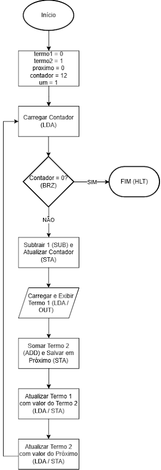

# LMC: Sequência de Fibonacci

Este diretório contém a implemetação de um programa que apresentasse uma sequência finita de valores que use uma ordem diferente da contagem regressiva. A sequência de Fibonacci foi a escolhida.

## Objetivo
Construir um programa em linguagem Assembly, capaz de calcular e exibir uma sequência de Fibonacci finita, demonstrando domínio sobre o ciclo de execução da CPU. O programa exibe os 15 primeiros termos da sequência de Fibonacci e encerra automaticamente.

## Fluxograma do Algoritmo
 

## Explicação da Lógica
O programa utiliza um ciclo condicional de repetição ('loop') controlado por uma variável de contagem. 

### 1. Ciclo
 * O programa inicia carregando o limite de repetições ('LDA contador', iniciado em 15).
 * A instrução 'BRZ fim' verifica a condição de parada: se o acumulador for igual a 0, o programa desvia para a instrução 'HLT' e encerra.
 * Caso não seja 0, o programa subtrai 1 ('SUB um) e salva o novo valor atualizado na memória ('STA contador').

### 2. Cálculos e Saída 
 A sequência exige a soma dos dois números anteriores para que seja gerado o próximo.
 * 'LDA termo1' seguido de 'OUT': Envia o número atual para o monitor.
 * 'ADD termo2': O acumulador (que já continha o termo 1) soma o valor do termo 2.
 * 'STA proximo': Utilizamos uma variável auxiliar para "guardar" o resultado dessa soma temporáriamente, de modo que o acumulador esteja livre na etapa subsequente. 

### 3. Atualização da memória
 Para que o próximo ciclo de contagem funcione, o acumulador precisa ser "liberado".
 * O termo1 recebe o valor do termo2 ('LDA termo2 / 'STA termo1').
 * O termo2 recebe o valor recém-calculado que foi armazenado na varíavel de rascunho ('LDA proximo' / 'STA termo2').
 * A instrução 'BRA loop' faz o desvio incodicional para reiniciar o processo com os novos valores, seguindo até completar todas as rodadas. 
